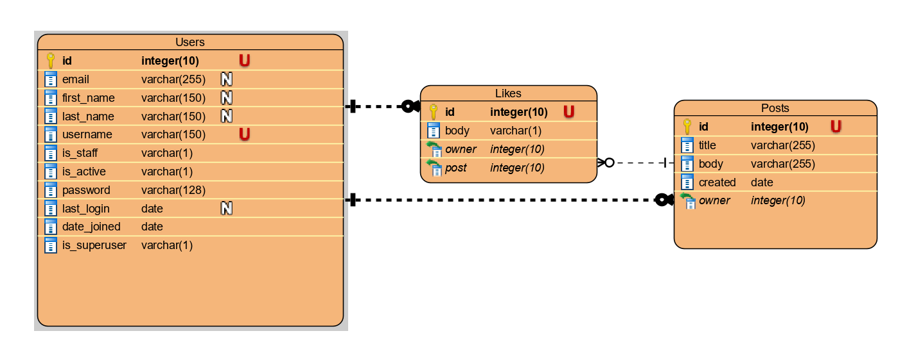

# Задание для собеседования
API написан на Django Rest Framework. В качестве базы данных выбран PostgreSQL

### Функционал API:
- Регистрация пользователей
- Авторизация пользователей по JWT.
- Создание, чтение, обновление, удаление пользователей.
- Создание, чтение, обновление, удаление постов.
- Лайк поста и отмена лайка

### Ниже представлена ER-диаграмма API


## Маршруты
| Метод                  | Маршруты                       | Функционал                                             | Доступ                                      |
|------------------------|--------------------------------|--------------------------------------------------------|---------------------------------------------|
| *POST*                 | ```/user/signup/```            | _Регистрация нового пользователя_                      | _Все пользователи_                          |
| *POST*                 | ```/api/token/```              | _Авторизация пользователя_                             | _Все пользователи_                          |
| *POST*                 | ```/api/token/refresh/```      | _Обновление токена входа_                              | _Все пользователи_                          |
| *POST*                 | ```/api/token/verify/```       | _Проверка действительности токена_                     | _Все пользователи_                          |
| *GET*                  | ```/users/```                  | _Просмотр всех пользователей_                          | _Зарегистрированный пользователь_           |
| *GET*, *PUT*, *DELETE* | ```/users/{user_id}```         | _Получение конкретного пользователя, или работа с ним_ | _Зарегистрированный пользователь, владелец_ |
| *GET*                  | ```/posts/```                  | _Получение всех постов_                                | _Зарегистрированный пользователь_           |
| *GET*, *PUT*, *DELETE* | ```/posts/{post_id}/```        | _Получение конкретного поста, или работа с ним_        | _Зарегистрированный пользователь, владелец_ |
| *POST*                 | ```/posts/{post_id}/like/```   | _Поставить лайк посту_                                 | _Зарегистрированный пользователь_           |
| *DELETE*               | ```/posts/{post_id}/unlike/``` | _Убрать лайка у поста_                                 | _Зарегистрированный пользователь_           |
## Запуск проекта
1. Необходимо в файле __.env__ указать ваши данные для подключения к бд.
2. Создайте виртуальное окружение.
```bash
python -m venv env
```
3. Войдите в виртуальное окружение.
- Для windows.
```bash
env\Scripts\activate.bat
```
- Для unix систем.
```bash
source env/Scripts/activate
```
4. Используйте пакетный менеджер [pip](https://pypi.org/project/pip/) для установки зависимостей.
```bash
pip install -r requirements.txt
```
5. Переходим в директорию проекта.
```bash
cd backend/
```
6. Создаем миграции.
```bash
python manage.py migrate
```
7. Запуск проекта.
```bash
python manage.py runserver
```